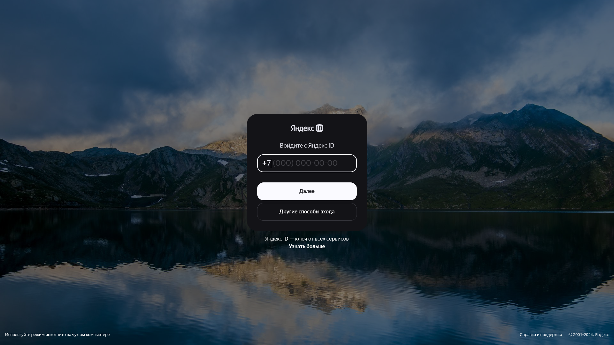
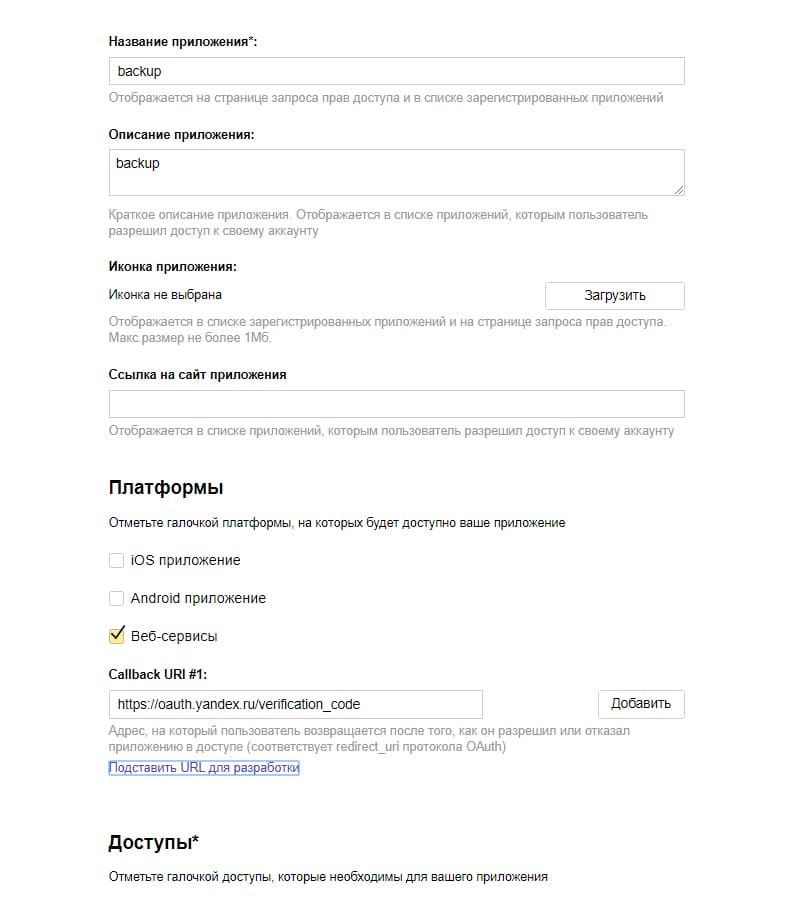
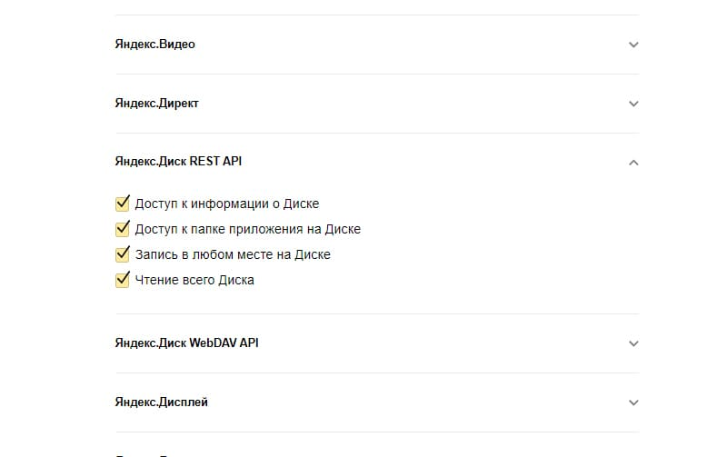

Чтобы получить токен который необходим для работы с Яндекс Диском, вам необходимо пройти по [ссылке](https://oauth.yandex.ru/client/new), авторизоватся если это не произошло автоматически 

Далее зарегистрируем наше приложение, назовём его к примеру, backup, и дадим ему полное разрешение для работы с Я.Диском.

Теперь нужно просто перейти по ссылке указанной ниже, заменив ID приложения на свой (ID вы получили после регистрации приложения), и токен готов.
`https://oauth.yandex.ru/authorize?response_type=token&client_id=<id_приложения>`